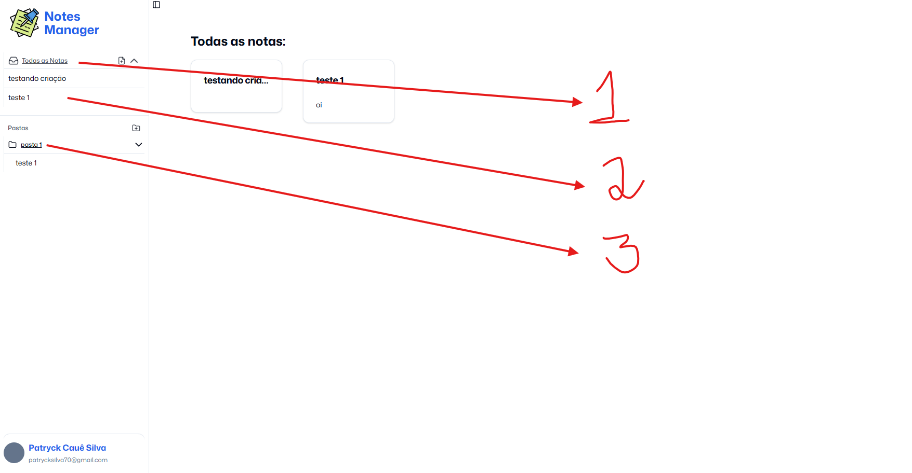

## Variáveis de ambiente:

- API_URL="http://localhost:5000/api/v1"

## Para rodar o Projeto:

1. Necessita abrir um terminal, e instalar as dependências com:
   `yarn`

2. Para rodar o ambiente de desenvolvimento, rodamos o comando:
   `yarn dev`

3. Caso queira rodar em produção precisamos buildar o o projeto:
   `yarn build`

4. Para rodar o ambiente de produção, rodamos o comando:
   `yarn start`

## Funcionalidades:

- [✅] Arquivo middleware para lidar com autenticação/redirecionamento do usuário;
- [✅] Página de registro e login;
- [✅] Página de listagem de todas as notas; (/dashboard)
- [✅] Modal de criação de uma nota;
- [✅] Página de edição e exclusão de uma nota; (/note/:id)
- [✅] Modal de criação de uma pasta;
- [✅] Página de atualização e exclusão de uma pasta; (/folder/:id)
- [✅] Todas as pastas e notas são mostradas na sidebar;
- [✅] Modal de perfil, com logout;
- [✅] Utilização de React server components e Action Servers;
- [✅] Utilização de cache do fetch(), e revalidação do cache por tags;
- [✅] Http Client Adapter para controlar requisições;
- [✅] Skeleton Loadin para carregamento de notas, e pastas;
- [✅] Utilização de Cookies para autenticação;
- [✅] Responsividade para mobile;

### Tecnologias Utilizadas

- NextJs;
- Typescript;
- React;
- TailwindCSS;
- Shadcn/ui;
- React Hook Form;
- Zod;

### Observações:

Ao Clicar nos nomes sublinhados, você será redirecionado para a página de edição da nota ou pasta.

em relação ao print:
1 - abre a page com todas as notas;
2 - abre page específica de uma nota;
3 - abre page específica de uma pasta.

Além disso na sidebar, podemos fecha os menus ("Todas as notas", e as pastas).

Temos os icones de criação de pasta e nota que abrem seus respectivos modais de criação, e ao clicar com botão direito do mouse em cima do "Todas as Notas" ele abre o modal de criação de nota
